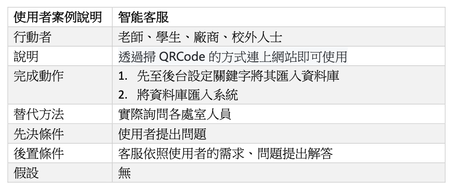

## 第10組
# 專題名稱：校園導覽系統  
| **職位** | **姓名** | **學號** | **工作分配**|
| :---     |  :---       |  :---   | :---      |
|   組長   | 羅子秈   | C110118230  |     程式撰寫      |
|   組員   | 古詠心   | C110118214  |     程式測試      |
|   組員   | 黃羚蓁   | C110118215  |     資料處理      |
|   組員   | 林芳儀   | C110118226  |     文書處理      |

## 專題簡介
近年來，由五大校區合併成為高雄科技大學，為了讓新生們、家長們能夠在這廣大的校園更加了解校園裡每一處角落，並且更加快速到達目的地，因此我們設計了一款系統讓大家能夠更方便抵達學校的各個角落，系統內也有設置導覽的路線，讓新加入的學生透過手機查看前往目的地的路線，避免因走錯教室或找不到教室、活動中心、行政大樓、游泳池、體育館，甚至是其他校區等具體位置而遲到。除此之外，系統內還有設置樓層介紹，像是活動中心各樓層的商家和活動的教室、行政大樓的各處室，綜合業務處的各單位、廁所及飲水機。另外設有智能客服可以提供即時的回覆，讓有其他疑問的人能夠透過此客服功能來解決他們的問題，對於各商家及學餐的營業時間有不清楚的，也可向客服來作詢問。

---
### 甘特圖

---

### PERT/CPM圖

---

### 關鍵路徑
1 → 2 → 3 → 4 → 5 → 7 → 9 → 11

---

### 功能性需求/非功能性需求

| 功能性需求：     |               |
| ------------- | ------------- |
| 1.校園AR地圖  | 透過鏡頭將會在螢幕上以AR方式顯示方向路徑的指示  |
| 2.校園各棟總攬  | 點擊該棟資訊欄將顯示該棟建築的名稱、教室、各處室、廁所及飲水機等等  |
| 3.物件及地點標示 | 到達該場所即顯示該場所的名稱、課表等資訊  |
| 4.智能客服  | 以線上問答的方式及時回覆問題  | 

| 非功能性需求：   |               |
| ------------- | ------------- |
| 1.可靠度  | 保證讓迷路的人能夠照著地圖的指示抵達目的地    |
| 2.易用性  | 透過掃QRcode的方式連上網站即可使用    |
| 3.無障礙 | 只要有相機能夠掃描就可以使用此網站，即使沒有也可在瀏覽器打上網址進入  |
| 4.可擴展性  | 方便未來添加更多功能或地點資料標籤  | 

---
### 功能分解圖(functional decomposition diagram, FDD)

---
### 需求分析的文字描述
1. 校內外人士皆可使用此系統進行導覽
2. 使用者藉由點選目的地按鈕獲取該地路線與資訊
3. 校園當前活動資訊路線導覽
4. 使用者透過智能客服取得及時協助
5. 透過關於我們來了解學校的一切

---
### 使用案例圖

---

### 使用案例說明圖

---
### 使用Figma劃出第一個使用案例的動態模擬畫面

---

---
### 系統環境圖DFD與DFD 圖0

---
